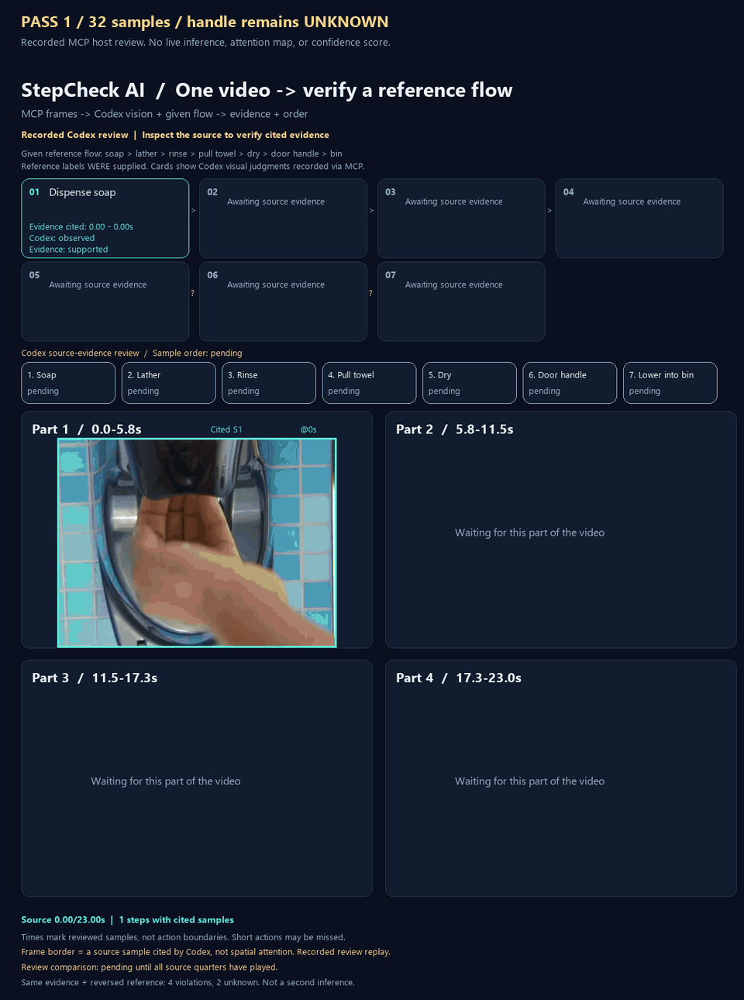
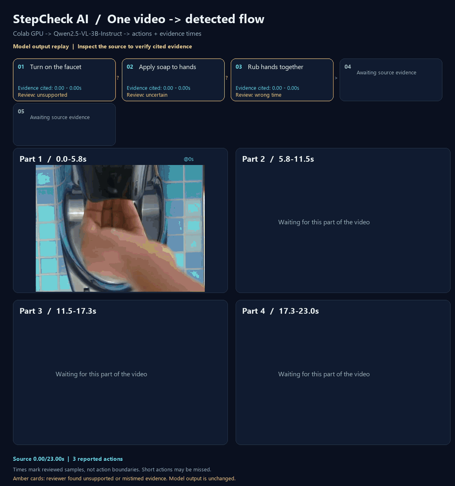
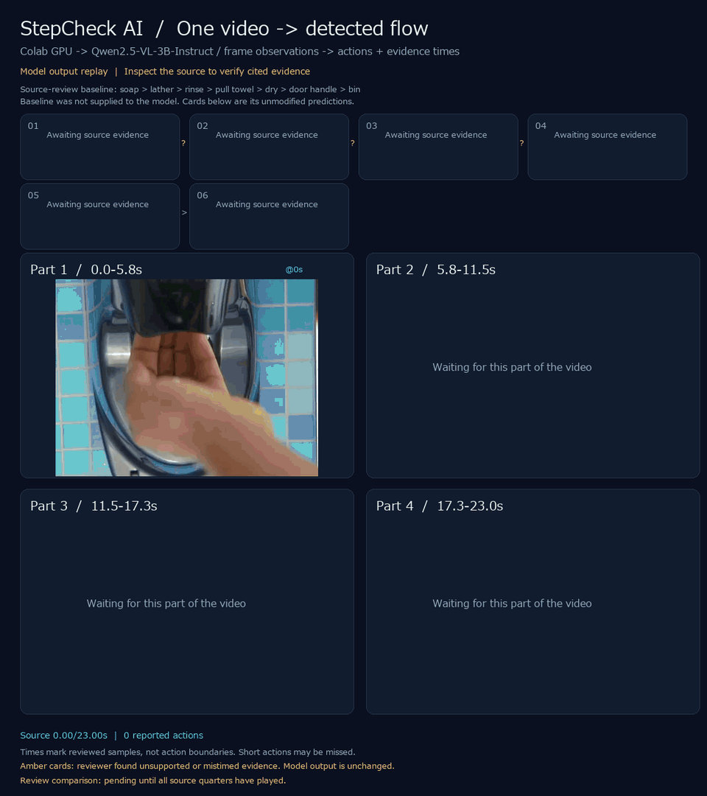

<div align="center">

# StepCheck AI

**Discover work flows from video. Verify procedures from images.**

One video → vision-language model → observed actions, order, and evidence frames.

[Quick start](#quick-start) · [How it works](#how-it-works) · [Architecture](docs/architecture.md) · [Build a provider](docs/providers.md)

[](https://colab.research.google.com/github/rsasaki0109/stepcheck-ai/blob/main/notebooks/stepcheck_local_vlm.ipynb)



<sub>One real video → MCP review → unknown handle → follow-up images → sample-order check. Recorded judgments; frame borders mark cited evidence, not attention.</sub>

</div>

StepCheck AI uses a **vision-language model (VLM)** to discover actions from a single video,
and to check whether work was carried out
**according to a written procedure**. The included `OpenAIProvider` sends the Markdown
steps and work images to a multimodal model (configured as `gpt-4o` by default), which
judges each step as ✅ completed, ❌ not done, or ⚠️ undetermined — with a confidence
score and a human-readable reason grounded in the images.

The GIF above replays **Codex visual review of actual source frames obtained through MCP**.
The host first inspects 32 real source samples against a
[given seven-step reference](examples/observed-handwashing-flow.json). Four panels replay
chronological time quarters. Frame borders identify actual cited samples, not spatial attention.
The MCP server extracts images, validates cited timestamps, and checks order; the host performs vision review.

The first pass leaves handle contact **unknown**. `refine_reference_flow(previous)` selects
19.5–22.5 seconds from neighboring observed evidence and requests eight new samples plus four
context samples. Codex sees the paper-mediated grip at 21.5 seconds, updates that one judgment,
and preserves the six earlier observations. Both before and after results are saved.

The seven visible actions are supported in sampled order: soap → lather → rinse → pull towel
→ dry → hold door handle → lower towel into bin. Reversing the reference against the same
observations produces six order violations. This checks recorded sample order; actual door
opening, towel release, and uninterrupted execution remain unconfirmed.
See [the MCP images, judgments and order checks](docs/reference-flow-verification.md).
This known-video review is not an accuracy benchmark or an automatic Qwen success.

For a sampling-capable vision host, `verify_reference_flow(reference, sample_interval_seconds=0.75)`
now combines source-image sampling, host review, and order checking in one MCP tool call.
An [actual stdio sampling run](docs/reference-flow-verification.md#mcp-samplingで一度に確認する)
identified six actions but left handle contact unknown with only the 32 uniform/end samples.
The GIF above replays that run and its [actual follow-up sampling](docs/reference-flow-verification.md#未確認の工程を追加画像で再確認する).
Search windows are hints from the given reference; they do not prove absence elsewhere.

A [different-video check](docs/new-video-transfer.md) fixed a five-step reference before
the first source inspection. Codex judged four steps observed, but drying stayed unknown
after 12 additional samples, so the full flow stayed **unknown**. The video, raw MCP
requests/responses, failed budget attempt, and an evidence GIF are saved for inspection.

`verify_reference_flow_auto(reference)` now runs initial review and one follow-up in a
single MCP tool call, widening the follow-up interval to fit its image budget. It stops
with unknowns preserved when evidence is still missing. See the [actual automatic workflow
and one-command adapter](docs/automatic-reference-workflow.md); recognition still requires
a vision-capable sampling host.
The adapter accepts `--video` and automatically exports `report.html`, with four chronological
views, clickable cited frames, initial/final verdicts, and the actual submitted image sheets.
Open the [recorded evidence report](docs/assets/automatic-reference-report.html) from a local
checkout to inspect the same run; GitHub displays the HTML as a file.

The **Qwen3 local experiments remain unverified**: open-ended native video returns three
coarse actions; supplying reference steps and checking four windows still produces wrong
evidence and invalid pair IDs. These raw outputs are preserved separately in the
[reference verification experiments](docs/reference-flow-verification.md#qwenの実際の試行結果),
[open-ended native-video run](docs/qwen3-native-video.md), and
[earlier Colab runs](docs/colab-local-vlm.md).
The [controlled input diagnostics](docs/vlm-input-diagnostics.md) compare real inputs,
Qwen2.5-VL 3B/7B and Qwen3-VL 4B, preprocessing, and vision precision.

The web app now accepts **a single video** and lets you inspect each recognized
action's supporting frames, source timestamps, reasons, and uncertainties. Video
recognition uses `openai` or the GPU-based `qwen-local` provider; `mock` does not generate video
verdicts. The **recorded demo** works without a key and is explicitly labeled as a
replay. Image-based procedure verification remains available in its own tab.

The image model sits behind a model-agnostic `VisionProvider` interface. Add and register
a provider to change the model without rewriting the use case or UI.

## How it works

### Discover a flow from video

1. **Choose a video.** Open the video tab and upload one local file.
2. **Detect the flow.** The backend samples the entire video and asks the VLM to
   identify actions without providing an expected procedure.
3. **Inspect evidence.** Select an action to seek the source video and view its
   exact extracted frames, reasons, and uncertainties. Overlapping evidence is
   shown as ambiguous order.

For OpenAI inference, set `STEPCHECK_PROVIDER=openai`, `OPENAI_API_KEY`, and a vision model supporting
structured output (the existing default is `gpt-4o`). For a recorded preview, choose
**記録済みデモを見る** to replay the saved Codex review of the bundled video.
Live recognition of a new upload is separate from that recorded demo.

For **keyless live recognition**, open the [local-VLM Colab notebook](notebooks/stepcheck_local_vlm.ipynb).
It offers Qwen2.5-VL-3B/7B and Qwen3-VL-4B on the runtime GPU, observes each sampled frame, and generates a flow/evidence viewer
from the chosen video. See [Colab/local GPU setup](docs/colab-local-vlm.md). The same
provider can be selected in the backend with `STEPCHECK_PROVIDER=qwen-local`.

<details>
<summary>Actual Colab local-VLM run: inspect the errors, too</summary>



Qwen2.5-VL-3B ran on a T4 with 24 real source frames. This initial run contains
incorrect actions and evidence times. Model output is unchanged; amber cards show
an independent Codex review after inference, not attention or model confidence.
The current input binds each image directly to its ID and time. See the
[raw output, review, and execution notes](docs/colab-local-vlm.md#colabで実行して確認したこと).
The 7B comparison also completed. It misidentified the towel dispenser and failed to
recover the full flow; its raw output and execution conditions are saved in the same guide.

</details>

### Verify a written procedure from images

1. **Write the procedure.** Paste a Markdown ordered list, bullet list, or checklist.
2. **Attach work images.** Add one or more photos of the work.
3. **Run the check.** Review each step's verdict, confidence, and reason.

Try the [PC assembly](examples/pc-build.md) or [coffee brewing](examples/coffee-brewing.md)
procedure. The default `mock` provider exercises the workflow without an API key;
select `openai` for image analysis.

---

## Features

- 📋 **Markdown procedures** — ordered lists, bullets, or checkboxes.
- 🖼️ **One or many images** per check, plus a [video frame-review demo through MCP](docs/video-demo.md).
- 🎬 **Single-video flow detection** — upload, recognize actions, and inspect supporting
  frames in the web UI. Timestamp overlap stays ambiguous; compare predictions with the source.
- ✅❌⚠️ **Per-step verdicts** with confidence and an explanation of the reason.
- 🔌 **Pluggable providers** — `mock`, `openai` (GPT-4o), and `qwen-local` (CUDA, no API key); add your
  own in one file.
- 🧱 **Clean architecture** backend (domain / application / interface) with a shared
  contract package.
- 🐳 **Docker & Compose**, **typed** end to end, **unit-tested**, **CI** on GitHub Actions.

---

## Architecture

```
frontend/    Next.js + TypeScript + Tailwind UI
backend/     FastAPI, clean architecture (domain / application / api)
providers/   stepcheck_providers — model-agnostic VisionProvider contract + models
examples/    Sample procedures
docs/        Architecture & provider-authoring guides
```

The application depends only on the `VisionProvider` **abstraction**; concrete models are a
replaceable detail. See [`docs/architecture.md`](docs/architecture.md) and
[`docs/providers.md`](docs/providers.md).

```
UI ──HTTP(markdown + images)──▶ FastAPI ──▶ VerifyProcedureUseCase
                                                   │ depends on abstraction
                                                   ▼
                                        VisionProvider (ABC)
                                   MockProvider · OpenAIProvider · …
```

---

## Quick Start

### Option A — Docker Compose (full stack)

```bash
git clone https://github.com/rsasaki0109/stepcheck-ai.git
cd stepcheck-ai
docker compose up --build
# Frontend: http://localhost:3000   API docs: http://localhost:8000/docs
```

Runs with the keyless `mock` provider by default. To use OpenAI, create a `.env` file
at the repository root:

```dotenv
STEPCHECK_PROVIDER=openai
STEPCHECK_MODEL=gpt-4o
OPENAI_API_KEY=your-api-key
```

Then run `docker compose up --build` again. The `.env` file is ignored by Git.

### Option B — Run locally

Run the backend and frontend in separate terminals, starting at the repository root.
Install FFmpeg first and ensure `ffmpeg` and `ffprobe` are on `PATH` for video input.
The Docker image includes them.

**Backend** (Python 3.10+, macOS / Linux):

```bash
python -m venv .venv
source .venv/bin/activate
python -m pip install -e "./providers[openai,dev]" -e "./backend[dev]"
cd backend
uvicorn app.main:app --reload --port 8000
```

<details>
<summary>Backend — Windows PowerShell</summary>

```powershell
python -m venv .venv
.\.venv\Scripts\python.exe -m pip install -e "./providers[openai,dev]" -e "./backend[dev]"
cd backend
..\.venv\Scripts\python.exe -m uvicorn app.main:app --reload --port 8000
```

</details>

**Frontend** (Node 20+):

```bash
cd frontend
npm install
npm run dev      # http://localhost:3000
```

The frontend connects to `http://localhost:8000` by default. To change it, copy
[`frontend/.env.local.example`](frontend/.env.local.example) to `frontend/.env.local`
and set `NEXT_PUBLIC_API_BASE`.

### Try it from the API

On macOS / Linux:

```bash
curl -X POST http://localhost:8000/api/verify \
  -F "procedure=<examples/pc-build.md" \
  -F "images=@photo.jpg"
```

---

## Configuration

Backend settings are environment variables (see [`backend/.env.example`](backend/.env.example)).
For local development, place them in `backend/.env`; Compose reads the `.env` at the repository root.

| Variable | Default | Description |
| --- | --- | --- |
| `STEPCHECK_PROVIDER` | `mock` | Provider name (`mock`, `openai`, `qwen-local`, …) |
| `STEPCHECK_MODEL` | `gpt-4o` | Model id passed to the provider |
| `STEPCHECK_LOCAL_MODEL` | `Qwen/Qwen2.5-VL-3B-Instruct` | GPU model used by `qwen-local`; requires the local extra |
| `OPENAI_API_KEY` | — | Required when provider is `openai` |
| `STEPCHECK_MAX_IMAGES` | `8` | Max images per request |
| `STEPCHECK_MAX_IMAGE_BYTES` | `10485760` | Max bytes per image (10 MiB) |
| `STEPCHECK_MAX_VIDEO_BYTES` | `52428800` | Max uploaded video bytes (50 MiB) |
| `STEPCHECK_MAX_VIDEO_SECONDS` | `120` | Max video duration |
| `STEPCHECK_MAX_VIDEO_FRAMES` | `48` | Max sampled frames; spacing increases to cover the entire video |
| `STEPCHECK_CORS_ORIGINS` | `["http://localhost:3000"]` | Allowed frontend origins, as a JSON array |

The supplied Compose file forwards the provider, model, and API key settings. Add other
settings to `services.backend.environment` when customizing limits or origins.

Frontend: `NEXT_PUBLIC_API_BASE` (default `http://localhost:8000`).

---

## README animation

The main GIF is stored at [`docs/assets/qwen-3b-framewise.gif`](docs/assets/qwen-3b-framewise.gif). Embed it from the
repository root with:

```markdown

```

To regenerate it from the real video, saved model predictions, and independent review (requires FFmpeg):

```bash
python -m pip install Pillow
python scripts/generate_detected_flow_gif.py --report docs/assets/video-demo/qwen-3b-framewise-flow.json --audit docs/assets/video-demo/qwen-3b-framewise-review.json --output docs/assets/qwen-3b-framewise.gif
```

Rendering replays saved predictions and review; it does not run inference.
Run a new model analysis with the [Colab notebook](notebooks/stepcheck_local_vlm.ipynb).
The separate Codex/MCP procedure GIF is [`docs/assets/demo.gif`](docs/assets/demo.gif),
generated with `python scripts/generate_readme_gif.py`.
To perform a new visual review, use the [MCP frame tools](docs/video-demo.md). A vision-capable host supplies
the recognition, so the MCP server itself needs no model API key.

Video: CDC's [Clean hands short](https://commons.wikimedia.org/wiki/File:Clean_hands_short.webm),
identified as public domain on its source page. See [source attribution](docs/assets/video-demo/SOURCE.md)
the [timestamped observations](docs/assets/video-demo/review.json), and the
[evidence region annotations](docs/assets/video-demo/regions.json).

---

## Testing

From the repository root, with development dependencies installed:

```bash
python -m pytest providers/tests -q      # contract + providers
python -m pytest backend/tests -q        # parser, use case, API
cd frontend
npm run typecheck
npm run lint
npm run build
```

---

## Roadmap

- [ ] JEPA / representation-model provider
- [x] Single-video upload, frame-based flow discovery, and evidence review in the web app / API
- [ ] Video-native temporal models
- [ ] PDF procedure ingestion
- [ ] Audio narration as an additional signal
- [ ] Batch processing API
- [ ] Per-step image/region evidence highlighting
- [x] Qwen2.5-VL local GPU provider and Colab notebook
- [ ] Gemini provider

The contract is designed so these are **additive** — see [`docs/providers.md`](docs/providers.md).

---

## Contributing

Contributions are welcome! See [`CONTRIBUTING.md`](CONTRIBUTING.md). A great first
contribution is a new provider (Gemini, Qwen2.5-VL, a local model) — the interface is one
method.

---

## License

[MIT](LICENSE) © StepCheck AI contributors. The included CDC footage is public domain;
see [video attribution](docs/assets/video-demo/SOURCE.md).
