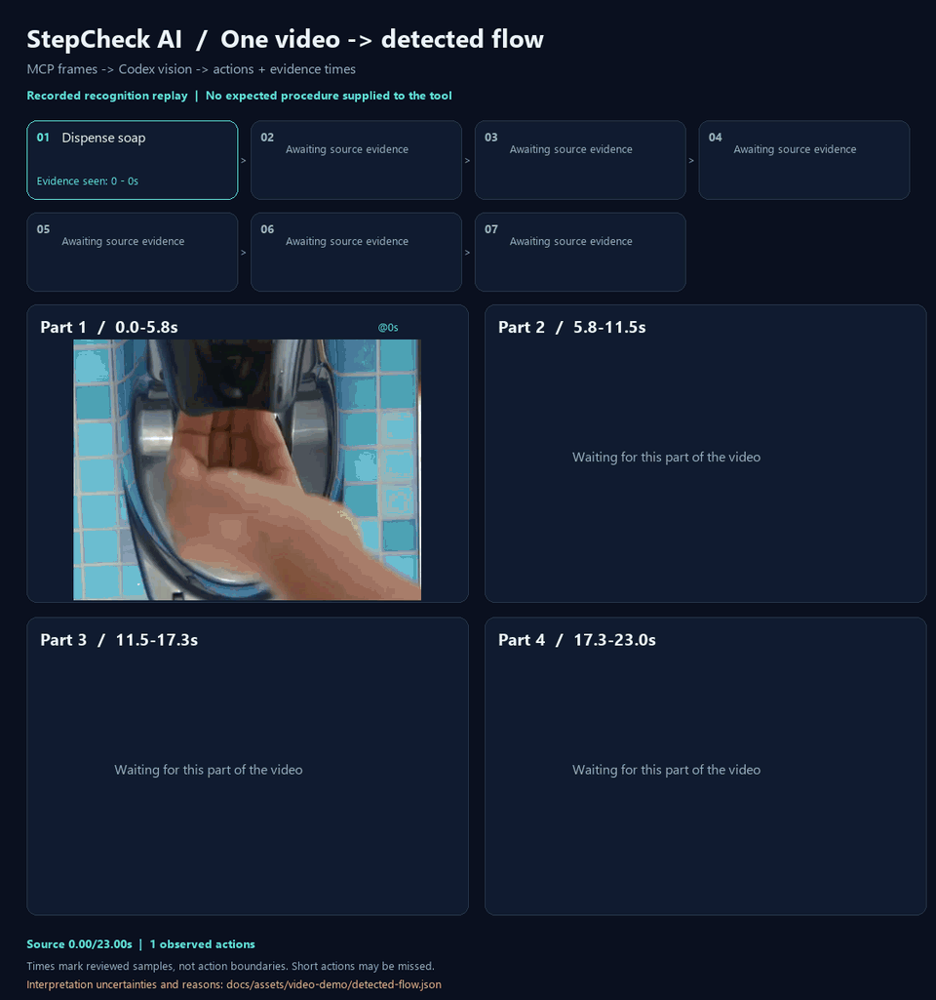
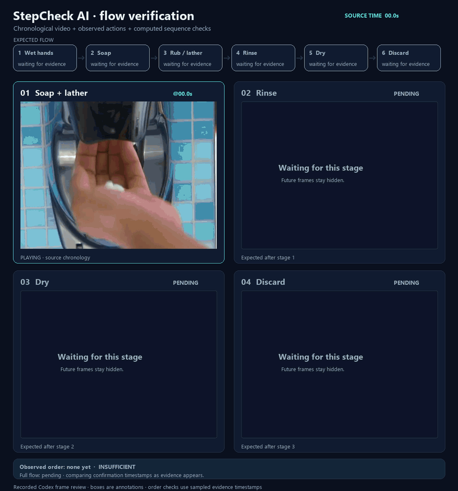

<div align="center">

# StepCheck AI

**Discover work flows from video. Verify procedures from images.**

One video → vision-language model → observed actions, order, and evidence frames.

[Quick start](#quick-start) · [How it works](#how-it-works) · [Architecture](docs/architecture.md) · [Build a provider](docs/providers.md)



<sub>One video → observed actions → flow. Labels appear with their supporting frames. Recorded Codex recognition through MCP; no attention heatmap.</sub>

</div>

StepCheck AI uses a **vision-language model (VLM)** to check whether work was carried out
**according to a written procedure**. The included `OpenAIProvider` sends the Markdown
steps and work images to a multimodal model (configured as `gpt-4o` by default), which
judges each step as ✅ completed, ❌ not done, or ⚠️ undetermined — with a confidence
score and a human-readable reason grounded in the images.

The GIF above demonstrates **flow discovery from one real video**. The MCP
`detect_flow()` tool sends timestamped source images to the connected vision host
without supplying an expected procedure. Codex recognized seven actions, including
pulling a paper towel and holding the door handle through that towel. The
[detected flow](docs/assets/video-demo/detected-flow.json) contains the visual reasons,
supporting timestamps, uncertainties, and computed order between observations.
Four panels play the video's time quarters in source order; action labels appear
only after supporting evidence is reached. This is a replay of recorded recognition,
with no heatmap. See [the video demo guide](docs/video-demo.md) for running detection
and, separately, comparing observations against an expected flow.

The web app now accepts **a single video** and lets you inspect each recognized
action's supporting frames, source timestamps, reasons, and uncertainties. Video
recognition uses the `openai` provider; the `mock` provider does not generate video
verdicts. The **recorded demo** works without a key and is explicitly labeled as a
replay. Image-based procedure verification remains available in its own tab.

The image model sits behind a model-agnostic `VisionProvider` interface. Add and register
a provider to change the model without rewriting the use case or UI.

## How it works

### Discover a flow from video

1. **Choose a video.** Open the video tab and upload one local file.
2. **Detect the flow.** The backend samples the entire video and asks the VLM to
   identify actions without providing an expected procedure.
3. **Inspect evidence.** Select an action to seek the source video and view its
   exact extracted frames, reasons, and uncertainties. Overlapping evidence is
   shown as ambiguous order.

Requires `STEPCHECK_PROVIDER=openai`, `OPENAI_API_KEY`, and a vision model supporting
structured output (the existing default is `gpt-4o`). For a keyless preview, choose
**記録済みデモを見る** to replay the saved Codex review of the bundled video.
Live recognition of a new upload is separate from that recorded demo.

### Verify a written procedure from images

1. **Write the procedure.** Paste a Markdown ordered list, bullet list, or checklist.
2. **Attach work images.** Add one or more photos of the work.
3. **Run the check.** Review each step's verdict, confidence, and reason.

Try the [PC assembly](examples/pc-build.md) or [coffee brewing](examples/coffee-brewing.md)
procedure. The default `mock` provider exercises the workflow without an API key;
select `openai` for image analysis.

---

## Features

- 📋 **Markdown procedures** — ordered lists, bullets, or checkboxes.
- 🖼️ **One or many images** per check, plus a [video frame-review demo through MCP](docs/video-demo.md).
- 🎬 **Single-video flow detection** — upload, recognize actions, and inspect supporting
  frames in the web UI. Timestamp overlap stays ambiguous; missing actions are not invented.
- ✅❌⚠️ **Per-step verdicts** with confidence and an explanation of the reason.
- 🔌 **Pluggable providers** — `mock` (no API key) and `openai` (GPT-4o) included; add your
  own in one file.
- 🧱 **Clean architecture** backend (domain / application / interface) with a shared
  contract package.
- 🐳 **Docker & Compose**, **typed** end to end, **unit-tested**, **CI** on GitHub Actions.

---

## Architecture

```
frontend/    Next.js + TypeScript + Tailwind UI
backend/     FastAPI, clean architecture (domain / application / api)
providers/   stepcheck_providers — model-agnostic VisionProvider contract + models
examples/    Sample procedures
docs/        Architecture & provider-authoring guides
```

The application depends only on the `VisionProvider` **abstraction**; concrete models are a
replaceable detail. See [`docs/architecture.md`](docs/architecture.md) and
[`docs/providers.md`](docs/providers.md).

```
UI ──HTTP(markdown + images)──▶ FastAPI ──▶ VerifyProcedureUseCase
                                                   │ depends on abstraction
                                                   ▼
                                        VisionProvider (ABC)
                                   MockProvider · OpenAIProvider · …
```

---

## Quick Start

### Option A — Docker Compose (full stack)

```bash
git clone https://github.com/rsasaki0109/stepcheck-ai.git
cd stepcheck-ai
docker compose up --build
# Frontend: http://localhost:3000   API docs: http://localhost:8000/docs
```

Runs with the keyless `mock` provider by default. To use OpenAI, create a `.env` file
at the repository root:

```dotenv
STEPCHECK_PROVIDER=openai
STEPCHECK_MODEL=gpt-4o
OPENAI_API_KEY=your-api-key
```

Then run `docker compose up --build` again. The `.env` file is ignored by Git.

### Option B — Run locally

Run the backend and frontend in separate terminals, starting at the repository root.
Install FFmpeg first and ensure `ffmpeg` and `ffprobe` are on `PATH` for video input.
The Docker image includes them.

**Backend** (Python 3.10+, macOS / Linux):

```bash
python -m venv .venv
source .venv/bin/activate
python -m pip install -e "./providers[openai,dev]" -e "./backend[dev]"
cd backend
uvicorn app.main:app --reload --port 8000
```

<details>
<summary>Backend — Windows PowerShell</summary>

```powershell
python -m venv .venv
.\.venv\Scripts\python.exe -m pip install -e "./providers[openai,dev]" -e "./backend[dev]"
cd backend
..\.venv\Scripts\python.exe -m uvicorn app.main:app --reload --port 8000
```

</details>

**Frontend** (Node 20+):

```bash
cd frontend
npm install
npm run dev      # http://localhost:3000
```

The frontend connects to `http://localhost:8000` by default. To change it, copy
[`frontend/.env.local.example`](frontend/.env.local.example) to `frontend/.env.local`
and set `NEXT_PUBLIC_API_BASE`.

### Try it from the API

On macOS / Linux:

```bash
curl -X POST http://localhost:8000/api/verify \
  -F "procedure=<examples/pc-build.md" \
  -F "images=@photo.jpg"
```

---

## Configuration

Backend settings are environment variables (see [`backend/.env.example`](backend/.env.example)).
For local development, place them in `backend/.env`; Compose reads the `.env` at the repository root.

| Variable | Default | Description |
| --- | --- | --- |
| `STEPCHECK_PROVIDER` | `mock` | Provider name (`mock`, `openai`, …) |
| `STEPCHECK_MODEL` | `gpt-4o` | Model id passed to the provider |
| `OPENAI_API_KEY` | — | Required when provider is `openai` |
| `STEPCHECK_MAX_IMAGES` | `8` | Max images per request |
| `STEPCHECK_MAX_IMAGE_BYTES` | `10485760` | Max bytes per image (10 MiB) |
| `STEPCHECK_MAX_VIDEO_BYTES` | `52428800` | Max uploaded video bytes (50 MiB) |
| `STEPCHECK_MAX_VIDEO_SECONDS` | `120` | Max video duration |
| `STEPCHECK_MAX_VIDEO_FRAMES` | `48` | Max sampled frames; spacing increases to cover the entire video |
| `STEPCHECK_CORS_ORIGINS` | `["http://localhost:3000"]` | Allowed frontend origins, as a JSON array |

The supplied Compose file forwards the provider, model, and API key settings. Add other
settings to `services.backend.environment` when customizing limits or origins.

Frontend: `NEXT_PUBLIC_API_BASE` (default `http://localhost:8000`).

---

## README animation

The GIF is stored at [`docs/assets/demo.gif`](docs/assets/demo.gif). Embed it from the
repository root with:

```markdown

```

To regenerate the GIF from the included video and saved Codex observations (requires FFmpeg):

```bash
python -m pip install Pillow
python scripts/generate_readme_gif.py
```

Rendering replays the saved review; it does not run inference. To perform a new visual
review, use the [MCP frame tools](docs/video-demo.md). A vision-capable host supplies
the recognition, so the MCP server itself needs no model API key.

Video: CDC's [Clean hands short](https://commons.wikimedia.org/wiki/File:Clean_hands_short.webm),
identified as public domain on its source page. See [source attribution](docs/assets/video-demo/SOURCE.md)
the [timestamped observations](docs/assets/video-demo/review.json), and the
[evidence region annotations](docs/assets/video-demo/regions.json).

---

## Testing

From the repository root, with development dependencies installed:

```bash
python -m pytest providers/tests -q      # contract + providers
python -m pytest backend/tests -q        # parser, use case, API
cd frontend
npm run typecheck
npm run lint
npm run build
```

---

## Roadmap

- [ ] JEPA / representation-model provider
- [x] Single-video upload, frame-based flow discovery, and evidence review in the web app / API
- [ ] Video-native temporal models
- [ ] PDF procedure ingestion
- [ ] Audio narration as an additional signal
- [ ] Batch processing API
- [ ] Per-step image/region evidence highlighting
- [ ] Gemini and Qwen2.5-VL providers

The contract is designed so these are **additive** — see [`docs/providers.md`](docs/providers.md).

---

## Contributing

Contributions are welcome! See [`CONTRIBUTING.md`](CONTRIBUTING.md). A great first
contribution is a new provider (Gemini, Qwen2.5-VL, a local model) — the interface is one
method.

---

## License

[MIT](LICENSE) © StepCheck AI contributors. The included CDC footage is public domain;
see [video attribution](docs/assets/video-demo/SOURCE.md).
