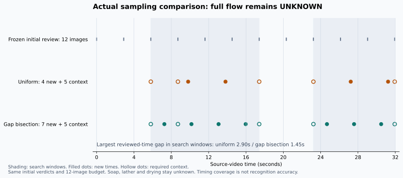

# レビュー時刻の空白を埋めて追加確認する

自動追加確認を、文脈画像を残したまま大きな時刻の空白を分割する方式へ変更しました。
等間隔を倍に広げる方式では、予算が余っても短い操作の間に新しい画像が入らない場合がありました。
WebとMCPの自動確認は同じ新しい選択処理を使います。手動のMCP追加確認の等間隔指定は維持しています。

## 選択と終了

前後の観測時刻から検索範囲を決め、境界と曖昧な引用画像を文脈として確保します。
初回のすべてのレビュー時刻を考慮し、範囲内の最大の空白から中間時刻を選びます。
希望する最大空白まで埋まるか、入力画像の予算に達すると計画を終了します。
範囲が重なる場合も同じ時刻を重複して追加しません。工程名・動作の正解時刻・画像内の空間的な注目度は選択に使いません。

文脈だけで予算を超える場合、または新しい画像を追加できない場合は、初回の未確認を保持して終了します。
選択できれば未確認の工程だけを1回再判定し、観測済みの理由・引用・不確実性を維持します。
非等間隔なので、選んだ一律の間隔を表す`chosen_interval_seconds`は`null`です。
`refinement.coverage`は検索範囲内の最大レビュー時刻の空白の変化と、予算による未達を記録します。
この値は画像の配置であり、短い動作の検出保証や信頼度ではありません。
検索範囲の境界を含めて算出し、モデルの入力だけでなく初回のすべてのレビュー時刻も考慮します。

## 実Qwenでの比較

[前回の実Qwen初回答](qwen3-web-auto.md)を固定しました。
動画・基準・初回画像・初回答が一致することを検証し、**新しいGPU推論は追加の1回だけ**実行しました。
通常のWebアップロードを新しく2回推論したという記録ではありません。
既知の手洗い動画であり、独立した未知動画の精度評価でもありません。

両方とも追加画像の予算12枚、Qwen3-VL-4Bの同じrevision、NF4、vision FP16、画素数上限50,176、
出力上限1,200トークンを使いました。新方式の追加推論は約150秒で完了しました。

| 項目 | 前回の等間隔調整 | 今回の空白分割 |
|---|---:|---:|
| 画像予算 | 12枚 | 12枚 |
| 実入力 | 9枚 | 12枚 |
| 新しい時刻 | 4枚 | 7枚 |
| 必須の文脈 | 5枚 | 5枚 |
| 追加後の最大レビュー時刻の空白 | 2.903273秒 | 1.451637秒 |
| 石けん・泡立て・乾燥 | 未確認 | 未確認 |
| 全体の順序 | 未確認 | 未確認 |

**画像の時刻配置は改善しましたが、今回の認識結果は改善しませんでした。**
1.45秒未満の動作や不明瞭な泡の見落としは残ります。予算内で希望の0.25秒まで埋められたわけではありません。
旧方式より実入力が3枚多いので、選択方式だけを切り離した精度比較とはいえません。
既知の「すすぐ」の理由にある、泡立てた後という条件の不十分な説明も、保持されたままです。

## 生データと検証

- [初回答の参照・新規GPU呼び出し数・実行コードとハッシュ](assets/video-demo/qwen3-gap-comparison/manifest.json)
- [新しい実入力12枚のラベル・プロンプト・画像ハッシュ](assets/video-demo/qwen3-gap-comparison/followup/request.json)
- [新しい生回答](assets/video-demo/qwen3-gap-comparison/followup/response.txt)
- [初回と最終判断・実画像・選択範囲](assets/video-demo/qwen3-gap-comparison/verification.json)
- [タイミング図のデータ](assets/video-demo/qwen3-gap-comparison/sampling-comparison.json)、[図と元データのハッシュ](assets/video-demo/qwen3-gap-comparison/sampling-chart-manifest.json)
- [元映像・派生JPEGの出典とライセンス](assets/video-demo/qwen3-gap-comparison/ATTRIBUTION.md)

Pythonの109件、MCPの56件、型チェックとWebの表示確認が通過しました。
制御テストは合成回答を使い、上記の推論記録と区別しています。
時刻の空白・予算・文脈保持・浮動小数点の丸め・引用検証・既知判断の維持を検証しています。
