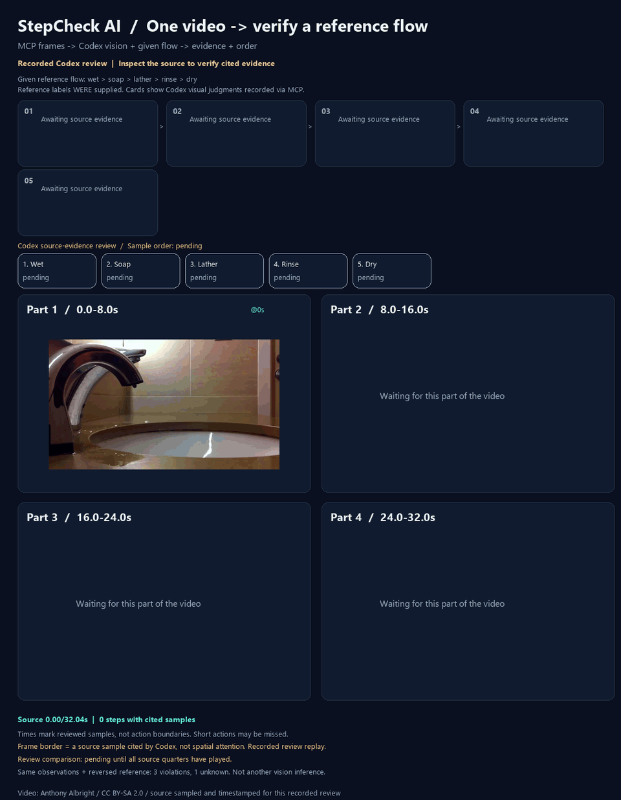

# 別の動画での基準フロー確認

**4工程を観測、乾燥は追加画像でも未確認。全体は`unknown`のままです。**
これはCodexがMCPの実画像を見た判断です。Qwenの自動認識、独立した人間による正解判定、
認識精度の点数を示すものではありません。未確認を「実施しなかった」とは扱いません。



映像: [Anthony Albright](https://www.flickr.com/photos/anthonyalbright/)「Hand Washing」。
[Flickrの原ページ](https://www.flickr.com/photos/anthonyalbright/4997782896/)から
[Wikimedia Commonsの配布ページ](https://commons.wikimedia.org/wiki/File:Hand_Washing_video.webm)を通じて取得。
元映像およびこの映像由来の画像・GIFは[CC BY-SA 2.0](https://creativecommons.org/licenses/by-sa/2.0/)です。
元映像は変更せず、画像を抽出・縮小して時刻を付け、GIFでは工程カードと記録の説明を追加しました。
映像の順序は入れ替えていません。出典の撮影者がこのプロジェクトを支持するという意味ではありません。

## 画像を見る前に固定した条件

[5工程の基準](../examples/new-video-handwashing-flow.json)は、
元映像をダウンロードして初めて表示する前のコミット
[`a870f66`](https://github.com/rsasaki0109/stepcheck-ai/commit/a870f6643b13179a1bb17c1cb43ecd5e7a467553)で固定しました。
基準のSHA-256は`be1c9b45c260511783e9a11e4ce582b61e4bda1ae3ff8b5d86b4859f9d596c05`です。

順序は「水で濡らす→石けんを付ける→泡で擦る→すすぐ→乾かす」です。
石けんはディスペンサー・ボトル・固形石けん、乾燥はタオル・紙・動作の見える乾燥機を対象としました。
映像を見た後で工程、可視条件、正解の時刻を基準に追加していません。
動画はタイトル・長さ・再利用条件の情報から選び、このセッションで以前に観察したCDC動画とは別のものです。
モデルの学習データとの重複まで除いた評価ではありません。

- [事前の実行計画](assets/video-demo/new-video-transfer/preinspection-plan.json)
- [固定した基準の元バイト](assets/video-demo/new-video-transfer/reference-frozen.json)
- [取得元・作者・ライセンス・動画ハッシュ](assets/video-demo/new-video-transfer/source.json)
- [変更していない元動画](assets/video-demo/new-video-transfer/source.webm)

## 実際のMCP samplingと判断

別プロセスのstdio MCPサーバーへ接続し、`verify_reference_flow`を呼びました。
初回は事前に決めた2秒間隔と終端付近の**18枚**。
ファイルアダプターから出力された2枚の時刻付き一覧画像をこのセッションのCodexが表示して確認し、
新しく書いたJSONをMCPのsampling応答として返しました。アダプターはモデルAPIを呼びません。

| 基準の工程 | 初回の判断 | 引用した時刻・画像 |
|---|---|---|
| 水で濡らす | observed | 2、4秒。水流が両手に触れる |
| 石けんを付ける | observed | 6秒。緑がかった固形石けんを手の間で扱う |
| 泡で擦る | observed | 12秒。水流から離して擦る手に薄い白い石けんの膜。小さい画像のため不確実性も記録 |
| すすぐ | observed | 16、20、24秒。泡で擦った後の手が流水に触れる |
| 乾かす | unknown | 26秒には手が画面から離れ、終端には蛇口と空の洗面台だけ。拭く動作や乾燥機を確認できない |

最初の4工程の引用順序は3つとも一致しますが、乾燥の確認がないため全体は`unknown`です。
これは主観的な視覚判定で、薄い泡などの意味的な誤認可能性を完全に除くものではありません。
数値の信頼度やアテンションマップは生成していません。

- [初回の実ツール入力](assets/video-demo/new-video-transfer/initial/tool-request.json)
- [初回のsamplingプロンプトと画像ハッシュ](assets/video-demo/new-video-transfer/initial/sampling-request.json)
- [前半の実入力画像](assets/video-demo/new-video-transfer/initial/sampling-0.png)、[後半](assets/video-demo/new-video-transfer/initial/sampling-1.png)
- [Codexの初回答](assets/video-demo/new-video-transfer/initial/response.json)、[検証された初回結果](assets/video-demo/new-video-transfer/initial/verification.json)

## 追加画像でも未確認を保つ

`refine_reference_flow`は、最後にすすぎを観測した24秒から31.936秒までを乾燥の探索範囲にしました。
事前に予定した0.25秒間隔・最大24枚は画像予算を超えたため、**画像認識を要求する前に拒否**されました。
この失敗を残し、新しい追加画像を見る前に間隔だけ0.5秒へ変更しました。基準と画像予算は変更していません。

再実行のsamplingでは**12枚の新しい時刻＋3枚の比較用画像**を取得しました。
24.5〜25.5秒はまだ水流と手、26秒に手が離れ、26.5〜31.936秒は蛇口と空の洗面台です。
追加画像にも拭く動作や乾燥機はなく、乾燥は`unknown`のままでした。
前の4工程の判断・理由・引用時刻は変更していません。重複を除いた確認画像は18＋12＝30枚です。

逆順の基準を同じ保存済みの観察と比べると、3関係が順序違反、乾燥との1関係は未確認です。
逆順比較は順序計算の対照であり、動画編集や2回目の工程認識ではありません。
範囲外や画面外で乾かした可能性は残り、追加画像が多くても完全な手順の証明にはなりません。

- [画像予算で拒否された実MCP応答](assets/video-demo/new-video-transfer/followup-budget-rejected/tool-result.json)
- [間隔を変えた理由・時刻](assets/video-demo/new-video-transfer/followup-adjustment.json)
- [追加の実ツール入力](assets/video-demo/new-video-transfer/followup/tool-request.json)、[samplingプロンプト](assets/video-demo/new-video-transfer/followup/sampling-request.json)
- [追加の実入力画像1](assets/video-demo/new-video-transfer/followup/sampling-0.png)、[画像2](assets/video-demo/new-video-transfer/followup/sampling-1.png)
- [乾燥の追加回答](assets/video-demo/new-video-transfer/followup/response.json)
- [更新前](assets/video-demo/new-video-transfer/followup/before-verification.json)、[更新後](assets/video-demo/new-video-transfer/followup/verification.json)、[逆順の結果](assets/video-demo/new-video-transfer/followup/reverse-verification.json)
- [実行コード・データ・GIFのハッシュ](assets/video-demo/new-video-transfer/manifest.json)

GIFは追加確認後の判断を、元映像の時刻に合わせて再生しています。再生中に認識は実行しません。
4パネルは同じ1本の映像を時間で等分したものです。枠は確認した工程で引用されたフレームを示し、
未確認の乾燥の画像には確認済みの枠を付けません。字幕やカードは記録された観察であり、
追加で独立したレビューをしたという表示ではありません。

## 再実行

新しい空の出力先を使います。表示された実画像を見てから、それぞれの`response.json`へ回答してください。

```powershell
$env:STEPCHECK_DEMO_VIDEO=(Resolve-Path 'docs/assets/video-demo/new-video-transfer/source.webm').Path
python scripts/run_flow_detection.py --bridge-dir .tmp-flow-local/new-source-initial --reference examples/new-video-handwashing-flow.json --interval 2 --output .tmp-flow-local/new-source-initial/verification.json --reviewer "connected vision session"
python scripts/run_flow_detection.py --bridge-dir .tmp-flow-local/new-source-followup --refine-from .tmp-flow-local/new-source-initial/verification.json --interval 0.5 --max-frames 24 --output .tmp-flow-local/new-source-followup/verification.json --reviewer "connected vision session"
```

保存済みのGIFだけを再生成する場合:

```powershell
python scripts/generate_detected_flow_gif.py --report docs/assets/video-demo/new-video-transfer/replay-flow.json --audit docs/assets/video-demo/new-video-transfer/review.json --video docs/assets/video-demo/new-video-transfer/source.webm --output docs/assets/new-video-transfer.gif --source-credit "Video: Anthony Albright / CC BY-SA 2.0 / source sampled and timestamped for this recorded review"
```

今回、元動画を切り替えられる`--video`をGIF生成に追加し、縦横比を維持して表示するようにしました。
MCPの汎用的な検証結果の注意文も、以前の取っ手・紙の例に固定された文から一般的な可視範囲の説明に変更しました。
公開した実際の応答は、この文の変更前の実行をそのまま保存しています。
