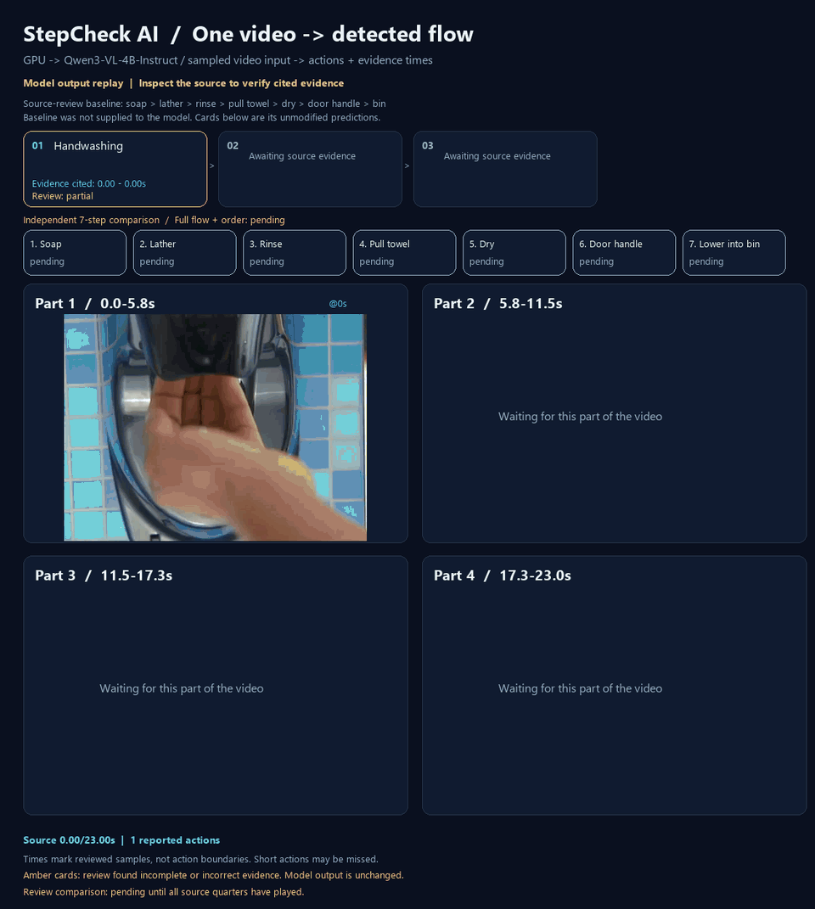

# Qwen3の動画入力と工程順の確認

同じ23.003秒の動画を、Qwen3-VL-4B-Instructの**動画入力**で認識する実験です。
静止画を1枚ずつ説明した前回とは異なり、複数フレームを動画として1回の呼び出しに渡します。
正解の工程名や期待する順番はプロンプトに含めません。

## 入力と記録

- 元動画: [source.webm](assets/video-demo/source.webm)。SHA-256は
  `b6afe16e598ec730d92185308220298f48a0b0865f7bacb39f5d34eecd61bbf3`。
- 4fpsで0〜22.75秒の92フレームを抽出。時間順を維持し、映像の並べ替えは行いません。
- 12〜17.75秒、16〜20.75秒、20〜22.75秒の重なる区間を4fpsで入力。
  全体の92枚入力は約8分42秒で回答未取得のまま停止し、2fpsの46枚で再実行。
  停止した試行をOOMや成功結果とは記録していません。
- 実際の入力テンソルから復元した画像、動画トークン数、元フレームID、時刻トークン、
  プロンプトと生の応答を保存します。
- 全体のJSON回答が参照するフレームペアIDを検証し、対応する2枚の元フレーム時刻へ変換します。
  存在しないIDや壊れたJSONは成功結果に変換しません。

Qwen3の時刻トークンは2フレームの平均時刻を小数1桁で表します。
区間入力でも元動画の絶対時刻を維持し、プロセッサーが実際に生成した時刻と照合します。
ペアの引用は動作の開始・終了時刻や意味の正しさを保証しません。
処理は[固定したTransformers 4.57.1の実装](https://github.com/huggingface/transformers/blob/v4.57.1/src/transformers/models/qwen3_vl/processing_qwen3_vl.py)に合わせています。

## 実行条件

| 項目 | 条件 |
|---|---|
| モデル | Qwen/Qwen3-VL-4B-Instruct |
| 固定revision | `ebb281ec70b05090aa6165b016eac8ec08e71b17` |
| GPU | ローカル NVIDIA GeForce GTX 1660 Ti / 6GB |
| 言語部分 | NF4、double quant、FP16 compute |
| 視覚部分 | FP16。実際のLinearのクラスとdtypeを記録 |
| ソフトウェア | Torch 2.11.0+cu128、Transformers 4.57.1、accelerate 1.15.0、bitsandbytes 0.48.2 |
| 区間入力 | 352×256、4fps |
| 全体入力 | 256×192、2fps、46枚、23フレームペア、1104動画トークン |

## 全体の認識結果と7工程の照合

全体の再実行は121.5秒で完了しました。JSONと引用IDは有効でしたが、意味と根拠の対応には誤りがあります。
以下はモデルの未修正のラベルです。日本語を指定したプロンプトに対して英語で返答しています。

| モデルの工程 | 引用した元動画の時刻 | 独立した確認 |
|---|---|---|
| Handwashing | 0〜12.5秒 | 石けん取得・泡で擦る・すすぐを一括にする。引用した大半の泡洗い画像に流水は映っていない |
| Tissue Dispensing | 13〜19.5秒 | 紙を引く14〜15秒に加え、後の手拭き画像も取得として引用 |
| Tissue Use | 20〜21.5秒 | 手拭き・廃棄と説明するが、引用画像は移動と紙越しの取っ手操作。入力したゴミ箱画像は引用しない |

7工程の比較では、石けん・すすぎ・取っ手が独立した工程として欠落、
泡洗い・紙の取得が部分的、手拭き・ゴミ箱への投入が時刻不一致でした。
6つの工程間の順序はすべて`unknown`です。3つの予測の引用時刻が順に並ぶことと、
7工程を正しく認識して順序を確認できることは別です。



- [実行条件・全体の生の回答](assets/video-demo/qwen3-native-video/diagnostics.json)
- [未修正のJSON回答](assets/video-demo/qwen3-native-video/response-whole.txt)
- [時刻付きフローと46枚の元画像](assets/video-demo/qwen3-native-video/flow.json)
- [実際にモデルへ渡った入力の復元画像](assets/video-demo/qwen3-native-video/input-whole.png)
- [実入力の時刻トークンとフレームペア対応](assets/video-demo/qwen3-native-video/input-whole.json)
- [独立した工程・順序の確認](assets/video-demo/qwen3-native-video/review.json)
- [実行時のコード](assets/video-demo/qwen3-native-video/experiment-source.py)
- [公開ファイルのSHA-256と整合性検証](assets/video-demo/qwen3-native-video/manifest.json)

GIFは保存結果の再生です。モデルの工程名・根拠・不明点を修正して成功に見せることはしません。

前回のColab T4 / FP16 / 24枚個別認識とは、量子化・GPU・解像度・サンプリングも異なります。
回答の変化を動画入力だけの効果とは判断できません。これは1本の動画の事例確認です。

## 重なる区間の回答

| 元動画の区間 | 生の回答の内容 | 推論後の独立した目視確認 |
|---|---|---|
| 12〜17.75秒 | すすぐ→紙を引く→紙で手を拭く | 主要な動作の変化を捉える。ただし紙を持って離れるとの記述は確認が必要 |
| 16〜20.75秒 | ディスペンサーをつかむ→紙を引く→紙を2つに分ける | 手拭きの区間を再び取得として解釈。分割も根拠が不明瞭 |
| 20〜22.75秒 | ディスペンサーから紙を引く→ゴミ箱に落とす | この区間にディスペンサーは映っていない。取っ手の操作を認識できず、紙の放出は遮られている |

生の回答は修正せず保存します。区間の文章回答から時刻付きの工程を推測して作ることはしません。
[区間の生の回答・条件・停止記録](assets/video-demo/qwen3-native-video-windows/diagnostics.json)と
実際の[区間入力](assets/video-demo/qwen3-native-video-windows/input-paper.png)、
[停止した全体入力](assets/video-demo/qwen3-native-video-windows/input-whole.png)を公開します。
この最初の実験は新規スクリプトを未コミットの状態で実行したため、
[その時点の実験コード](assets/video-demo/qwen3-native-video-windows/experiment-source.py)も保存しています。
全体の構造化回答と、以前から固定した
[7工程の観察基準](assets/video-demo/source-flow-baseline.json)との照合結果を別に記録します。

## 再実行

[Colab/local GPU環境](colab-local-vlm.md)にある依存関係とbitsandbytesを用意し、リポジトリのルートから実行します。

```powershell
python scripts/diagnose_qwen3_temporal.py docs/assets/video-demo/source.webm --output .tmp-flow-local/qwen3-temporal --whole-stride 2
```

成功した構造化回答から`flow.json`と`viewer.html`が生成されます。
`viewer.html`では工程を選んで元動画と引用画像を確認できます。
このスクリプトは公開動画の固定区間を使うオフライン実験であり、Webアプリの画像ベースの
`qwen-local` APIに動画入力を追加する変更ではありません。

`--variants whole`で全体のみ、`--whole-stride 1`で4fpsの全体入力を選べます。

ヒートマップ・アテンション値・校正済み信頼度は計測していません。
GIFの色は推論後の独立した目視確認結果を表します。
