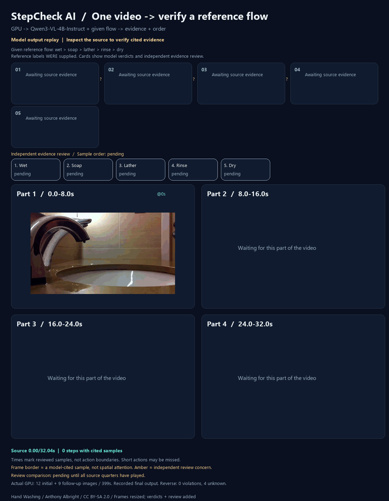

# Webの自動追加確認をローカルQwenで実行する

32.036秒の手洗い動画と、既存の5工程の基準を、Webの
`POST /api/video-flow/verify`へmultipartで渡しました。
FastAPI TestClientで実際のアップロード・一時保存・FFmpeg抽出・Qwen GPU推論を実行しています。
合成のモデル回答は使っていません。この動画は既に確認済みなので、未知動画の精度評価ではありません。

GIFは約399秒かかったバッチ判断の**最終結果の再生**です。画面の進行は動画の時刻で、モデルの応答速度ではありません。
緑の枠はモデルが引用したサンプル、黄のレビューはCodexが後から見た根拠の疑問です。
ヒートマップではなく、元のモデル判定も変更していません。
動画部分は表示用に5fpsで再抽出しています。モデルが見たのは初回12枚と追加9枚の実入力記録にある画像です。

## 実行条件

- Qwen3-VL-4B-Instruct、固定revision `ebb281ec70b05090aa6165b016eac8ec08e71b17`。キャッシュ済みの重みをオフラインで読み込み。
- GTX 1660 Ti（6GB）、言語側NF4、`visual`と`lm_head`は量子化対象から除外。
- 初回は2秒を希望し、全編を12枚に収めるため約2.903秒間隔と終端付近を使用。
- 自動追加確認を有効にし、追加希望間隔0.25秒、文脈画像を含む予算12枚。
- 工程名・可視条件は渡し、以前の判断や正解時刻はプロンプトに渡していません。

最初は画像ごとの画素数上限200,704、出力上限2,400トークンで実行しましたが、
初回回答が返らず**641秒で停止**しました。停止時のGPU空きメモリは約24MiBでした。
メモリ負荷が遅さに関係している可能性がありますが、OOMエラーを得たわけではありません。
[停止した実行の記録](assets/video-demo/qwen3-web-auto/manifest.json)には入力とコードを保存し、
成功した推論や認識結果として扱っていません。

次に同じ12枚を、画素数上限50,176、出力上限1,200トークンで実行しました。
GPU使用メモリは約4.6GBになり、初回回答は約246秒で返りました。
低い処理解像度では、短い動きや不明瞭な泡を見落とす可能性があります。

## 入力と初回答

初回のQwen回答は、濡らす・すすぐを`observed`、石けん・泡立て・乾燥を`unknown`としました。
「すすぐ」の理由は水の接触を説明していますが、基準にある「泡立てた後」という条件を十分に説明していません。
回答形式と引用先が正しくても、工程基準を満たす認識だと自動で保証できません。
既に観測した判断を保持する処理は、誤った既知判断の訂正機能ではありません。

未確認の3工程だけを再確認するため、追加の入力9枚を選びました。
0.25秒から間隔を倍に広げ、4秒で予算内になりました。新しい時刻は4枚、既存の文脈画像は5枚です。
検索範囲を広く取っても、予算によって間隔が粗くなれば短い石けん操作を拾えません。
新しい時刻は9.806545、13.806545、27.226182、31.226182秒です。

追加回答は約151秒で返り、石けん・泡立て・乾燥は3つとも未確認のままでした。
初回の濡らす・すすぐの判断をそのまま保持し、全体の順序は`unknown`、
終了理由は`unknown_after_followup`になりました。API全体は約399秒、HTTP 200です。
これは2段階の実処理と回答検証が完了したという意味で、全工程を認識できたという結果ではありません。

## 生データ

- [実行条件・呼び出し・API結果・ファイルハッシュ](assets/video-demo/qwen3-web-auto-small/manifest.json)
- [初回のプロンプト・画像ラベル・ハッシュ](assets/video-demo/qwen3-web-auto-small/pass-01/request.json)
- [初回の生回答](assets/video-demo/qwen3-web-auto-small/pass-01/response.txt)
- [追加のプロンプトと実入力9枚](assets/video-demo/qwen3-web-auto-small/pass-02/request.json)
- [追加の生回答](assets/video-demo/qwen3-web-auto-small/pass-02/response.txt)
- [初回・最終判断と根拠16枚を含む実API応答](assets/video-demo/qwen3-web-auto-small/api-response.json)
- [元動画と基準](new-video-transfer.md)、[出典と画像のライセンス](assets/video-demo/qwen3-web-auto-small/ATTRIBUTION.md)
- [GIF用の無改変判定・独立レビュー・エクスポートのハッシュ](assets/video-demo/qwen3-web-auto-small/replay-manifest.json)

各JPEGはモデルに渡した実バイトです。モデルはさらに処理解像度を調整します。
モデル出力を修正したり、ヒートマップ・信頼度を付けたりしていません。
`code/`は実行したコードのバイトを保存しています。通常のGitテキスト正規化と異なる場合もあるため、
記録したコードハッシュはそのスナップショットに照合してください。
`reference-source.json`も、実行時に記録した基準のSHA-256に一致する元バイトを保存しています。

Web機能の条件と終了理由は[Webの工程確認](web-reference-verification.md)を参照してください。
