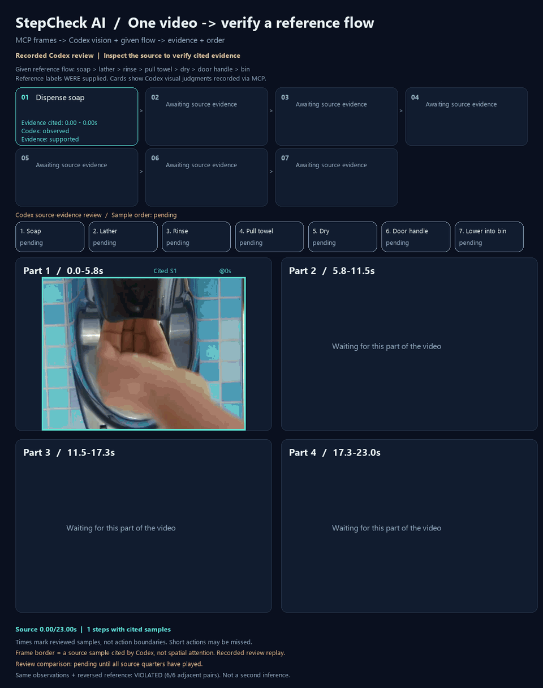

# 1本の動画と、定義したフローの照合

READMEの最新GIFは、**MCPで取得した元画像をCodexが見て判断した記録**です。
Qwenの結果を書き換えたものではなく、Qwenの自動認識が成功したという表示でもありません。
今回定義した[7工程の基準](../examples/observed-handwashing-flow.json)を与えて確認しています。

現在のGIFは、32枚で取っ手が未確認だったsampling実行から、
追加8枚で取っ手を確認するまでの2回のMCP視覚レビューを再生します。
下の33枚の個別`read_frame`レビューは以前の記録として残しています。


## 以前の33枚レビューで確認したこと

| 工程 | Codexが確認した元画像の時刻 | 見えている根拠 |
|---|---|---|
| 石けんを出す | 0、0.75秒 | ディスペンサー下の手のひらに白い石けんが現れる |
| 泡で手を擦る | 2.25、6、9.75秒 | 泡のついた手のひら・指・手の甲を擦る |
| 流水ですすぐ | 12、12.75秒 | 蛇口の水流が手に当たる |
| 紙を引く | 14.25、15秒 | 壁のスロットから白い紙を引き、分離した紙を持つ |
| 紙で手を拭く | 15.75、16.5、18.75、19.5秒 | 紙を両手の間で擦ったり折ったりする |
| 紙越しに取っ手を持つ | 21.5秒 | 紙を挟んでクロームのドアレバーを握る |
| 紙をゴミ箱に下ろす | 22.5、22.903秒 | 手と紙が袋を張ったゴミ箱の縁より下へ移動する |

各工程の最後の引用時刻が、次の工程の最初の引用時刻より前にあります。
このため、6つの工程間の**観測された順序**は基準に一致しました。
同じ観察結果を逆順の基準と比べると、6つすべてが順序違反になります。
この逆順比較は保存した観察結果に対する計算であり、2回目の視覚認識ではありません。

ドアが実際に開いたか、紙を離した瞬間は確認していません。
基準自体を「取っ手を持つ」「ゴミ箱内に下ろす」と定義しています。
映像には場面切り替えがあり、連続した作業の完遂や完全な衛生手順を証明するものではありません。



枠が光るのは**記録で引用した元フレーム**です。空間的なアテンションやヒートマップではありません。
カードは保存した判断を元動画の時刻に合わせて表示する再生で、GIF内でライブ推論しているわけではありません。

## MCPの実行と元画像

ローカルの`video_mcp.py`へMCP Python Clientで接続し、`read_frame`を呼び出しました。
0.75秒間隔と終端付近の32枚を取得・目視確認し、取っ手の画像がぶれていたため21.5秒の1枚を追加しました。
合計33枚の実PNG、各画像のSHA-256、ツールへの記録リクエストを保存しています。

新しい`record_reference_verification`は、ホストの実際の視覚レビューを記録します。
引用がレビューした時刻に含まれること、工程IDの過不足がないことを検証して順序を計算します。
MCPサーバー自体は画像認識を行いません。判断者は画像を見たホストのCodexです。
信頼度の数値は追加していません。

- [元画像のMCP取得ログ](assets/video-demo/codex-reference-verification/mcp-frame-log.json)
- [表示して確認した画像一覧](assets/video-demo/codex-reference-verification/sheet-1.png)、[中盤](assets/video-demo/codex-reference-verification/sheet-2.png)、[終盤](assets/video-demo/codex-reference-verification/sheet-3.png)
- [追加で確認した21.5秒の取っ手](assets/video-demo/codex-reference-verification/frame-32.png)
- [MCPへ渡した実際の観察記録](assets/video-demo/codex-reference-verification/record-request.json)
- [記録された7工程と順序](assets/video-demo/codex-reference-verification/verification.json)
- [同じ根拠を逆順の基準と比較した結果](assets/video-demo/codex-reference-verification/reverse-verification.json)
- [GIFの時刻付きデータ](assets/video-demo/codex-reference-verification/replay-flow.json)
- [公開データ・GIFのSHA-256と整合性確認](assets/video-demo/codex-reference-verification/manifest.json)

これは既知の1本の動画を再度確認した事例です。以前の観察から基準を定義しており、
未知の動画での精度評価や、ブラインドの工程発見の成功率を示しません。

## MCP samplingで一度に確認する

`verify_reference_flow(reference, sample_interval_seconds=0.75)`を追加しました。
基準と時刻付きの実画像をMCPのsamplingで視覚対応ホストへ送り、返された観察から順序を計算します。
基準に可視条件を書けますが、正解の時刻や過去の判断は送信しません。
応答には全工程のID、`observed`または`unknown`、理由、引用時刻、不確実性を要求します。
工程IDの過不足、未提供の時刻、JSON不正、元動画のハッシュ不一致は拒否し、以前の結果を置き換えません。
未確認や時間の重なる根拠は、順序一致にはなりません。

今回、別プロセスのstdio MCPサーバーへ接続して実行しました。
ファイルアダプターが実際のsamplingリクエストの3枚の一覧画像を出力し、
このセッションのCodexが表示された32フレームを見て新しく判断したJSONを返しました。
アダプター自身はモデルAPIを呼びません。通常のsampling対応ホストならアダプターは不要です。

**6工程を確認、取っ手は未確認、全体の順序は`unknown`**でした。
21.75秒の手と紙はぶれており、レバーを握る接触をこの画像だけでは確認できません。
21.5秒の追加画像は今回のsamplingに含まれていません。
以前の33枚レビューとは別の記録です。以前の成功した判断を流用していません。
現在のREADME GIFの第1段階は、この32枚レビューです。
逆順比較では確認できた4つの隣接関係が違反、取っ手に関わる2つは未確認です。
同じ既知の動画・基準であり、独立した認識精度の評価ではありません。

- [実際のツール入力](assets/video-demo/codex-reference-sampling/tool-request.json)
- [samplingのプロンプトと画像ハッシュ](assets/video-demo/codex-reference-sampling/sampling-request.json)
- [前半の入力](assets/video-demo/codex-reference-sampling/sampling-0.png)、[中盤](assets/video-demo/codex-reference-sampling/sampling-1.png)、[終盤](assets/video-demo/codex-reference-sampling/sampling-2.png)
- [Codexが今回返した応答](assets/video-demo/codex-reference-sampling/response.json)
- [検証済みの観察と順序](assets/video-demo/codex-reference-sampling/verification.json)、[逆順比較](assets/video-demo/codex-reference-sampling/reverse-verification.json)
- [MCPの実応答](assets/video-demo/codex-reference-sampling/tool-result.json)、[実行元コードと成果物のハッシュ](assets/video-demo/codex-reference-sampling/manifest.json)

ファイルを確認できる視覚対応セッション用のアダプターは次で起動します。
表示された実画像を見て、要求されたJSONを`response.json`へ書き込むとMCPへ返されます。
新しい動画には`STEPCHECK_DEMO_VIDEO`で元ファイルを指定します。
`--bridge-dir`には新しい空のディレクトリ、`--output`には保存先を指定してください。

```powershell
python scripts/run_flow_detection.py --bridge-dir .tmp-flow-local/new-reference-run --reference examples/observed-handwashing-flow.json --output .tmp-flow-local/new-reference-run/verification.json --reviewer "connected vision session"
```

このツールはMCPサーバー用です。Webアプリの動画APIにはまだ接続していません。

## 未確認の工程を追加画像で再確認する

`refine_reference_flow(previous, sample_interval_seconds=0.25, max_frames=24)`は、
保存済みの検証結果を受け取り、`unknown`の工程だけを視覚対応ホストに再確認させます。
前後で観測された工程の引用時刻から探索範囲を決め、既存画像と重複しない細かい画像を取り、
境界と不鮮明だった画像も比較用に渡します。既に確認した工程は変更できません。
未確認が残る応答も受け入れ、画像不足を自動的な成功にはしません。

今回、前の手拭きの最後の根拠19.5秒と、次のゴミ箱の最初の根拠22.5秒から範囲を選びました。
19.75、20、20.5、20.75、21.25、21.5、22、22.25秒の**8枚を追加**し、
19.5、21、21.75、22.5秒の4枚を比較用に付けて、実際のMCP samplingで送りました。
取っ手の正解時刻を指定するコードはありません。
このセッションのCodexが今回の一覧画像を表示して確認し、21.5秒の紙越しの握りを引用しました。

取っ手が`unknown`から`observed`になり、ほかの6工程の理由・時刻・判断はそのままです。
重複を除いた確認画像は32＋8＝40枚。6つの隣接関係の順序が一致しました。
同じ観察結果を逆順に照合すると6箇所が違反になります。
更新前の結果は`before-verification.json`に残し、更新後には元結果のハッシュと追加時刻を保存します。
不正な工程ID、今回渡していない時刻、元動画の不一致、不整合な元結果は保存前に拒否します。

探索範囲は**与えた順序からのヒント**です。範囲外での工程や繰り返しを否定するものではなく、
連続した作業の完遂も証明しません。隣接する根拠時刻が逆転している場合は空の範囲にせず、
動画全体へ探索を広げます。画像予算を超える場合は間隔や予算の変更を求め、勝手に画像を捨てません。

- [追加確認の実入力](assets/video-demo/codex-reference-refinement/tool-request.json)
- [実際に表示した12枚](assets/video-demo/codex-reference-refinement/sampling-0.png)、[samplingプロンプト](assets/video-demo/codex-reference-refinement/sampling-request.json)
- [今回の取っ手の判断](assets/video-demo/codex-reference-refinement/response.json)
- [更新前](assets/video-demo/codex-reference-refinement/before-verification.json)、[更新後](assets/video-demo/codex-reference-refinement/verification.json)、[逆順比較](assets/video-demo/codex-reference-refinement/reverse-verification.json)
- [MCPの実応答](assets/video-demo/codex-reference-refinement/tool-result.json)、[実行コード・画像・GIFのハッシュ](assets/video-demo/codex-reference-refinement/manifest.json)

```powershell
python scripts/run_flow_detection.py --bridge-dir .tmp-flow-local/new-follow-up --refine-from .tmp-flow-local/new-reference-run/verification.json --output .tmp-flow-local/new-follow-up/verification.json --reviewer "connected vision session"
```

現在のGIFは、第1段階の未確認を表示した後、追加画像を再生します。
追加画像の再生中も判断は未確認のままで、最後に保存した追加応答と順序を表示します。
再生速度は推論時間を示しません。GIF内の認識はライブではなく記録の再生です。

```powershell
python scripts/generate_reference_refinement_gif.py --before docs/assets/video-demo/codex-reference-refinement/before-verification.json --after docs/assets/video-demo/codex-reference-refinement/verification.json --output docs/assets/codex-reference-refinement.gif
```

## Qwenの実際の試行結果

同じ動画をローカルGTX 1660 Ti / 6GBのQwen3-VL-4Bへ渡す実験も行いました。
言語部分はNF4、視覚部分はFP16です。期待する工程名を渡しますが、正解の時刻や以前の観察文は渡しません。
Qwenの応答は修正せず、Codexの判断と別に保存しています。

| 試行 | 結果 |
|---|---|
| 動画全体＋7工程の名前 | 210.547秒。泡洗いの3〜4.5秒をすすぎの根拠にし、手拭き・取っ手・ゴミ箱は未確認。順序`unknown` |
| 同じ動画＋逆順の工程名 | 264.937秒。順序違反を計算できる引用はあるが、泡洗いとすすぎの根拠を混同。全工程の認識成功ではない |
| 4区間＋工程ごとの具体的な可視条件 | 泡を流水、泡洗いを石けん取得と誤認。3区間目は存在しないペアIDの14・15を引用して検証で拒否。全体結果は生成しない |

4区間は0〜5.5、6〜11.5、12〜17.5、18〜22.5秒の2fpsサンプルです。
各区間の実入力は352×256、元動画の絶対時刻を維持しています。
区間化と同時に解像度と基準の具体性も変えているため、変化を区間化だけの効果とは判断できません。

- [全体・逆順の生の応答と実行条件](assets/video-demo/qwen3-reference-verification/execution.json)
- [通常基準のQwen回答](assets/video-demo/qwen3-reference-verification/response-reference.txt)
- [逆順基準のQwen回答](assets/video-demo/qwen3-reference-verification/response-reverse.txt)
- [4区間の応答・引用IDの拒否記録](assets/video-demo/qwen3-reference-windows/execution.json)
- [4区間の実入力の一例](assets/video-demo/qwen3-reference-windows/input-part-4.png)
- [以前の、基準を渡さない動画入力](qwen3-native-video.md)

## 再実行

GPU環境では次を実行します。JSONと引用IDの検証を通った応答だけから時刻付きデータを生成します。
不正な引用IDを丸めたり、正しい時刻へ修正したりする処理はありません。

```powershell
python scripts/verify_qwen3_video_flow.py docs/assets/video-demo/source.webm --output .tmp-flow-local/reference-whole
python scripts/verify_qwen3_video_flow.py docs/assets/video-demo/source.webm --output .tmp-flow-local/reference-windows --windows
```

Codexをホストとする場合は[動画MCPサーバー](video-demo.md)の`read_frame`画像を実際に見てから、
`record_reference_verification`へ基準・観察・確認した画像の時刻を渡します。
保存先は`STEPCHECK_REFERENCE_REVIEW`で指定できます。
デフォルトは`docs/assets/video-demo/codex-reference-verification/verification.json`です。

このQwenスクリプトはオフライン実験です。Webアプリの`qwen-local` APIの認識方式は変更していません。
