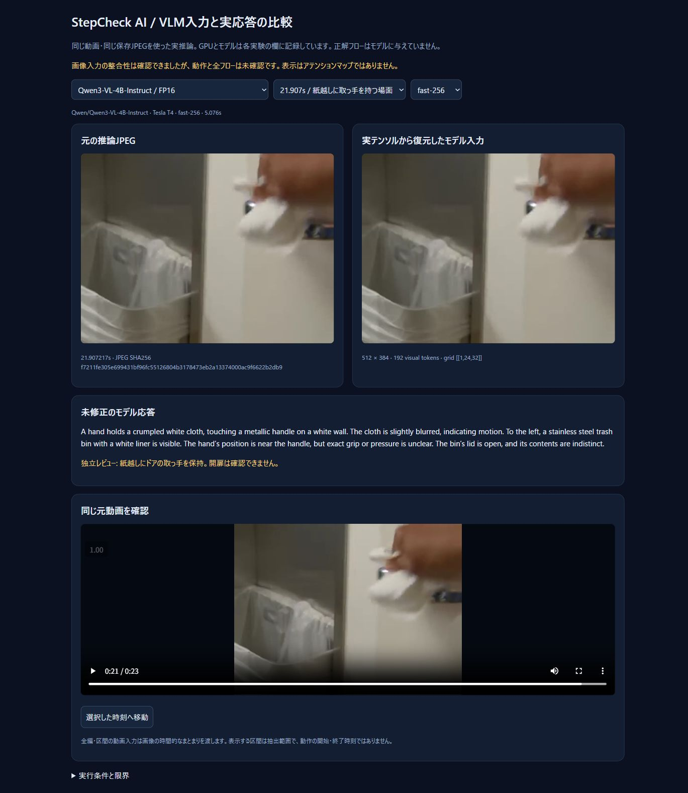
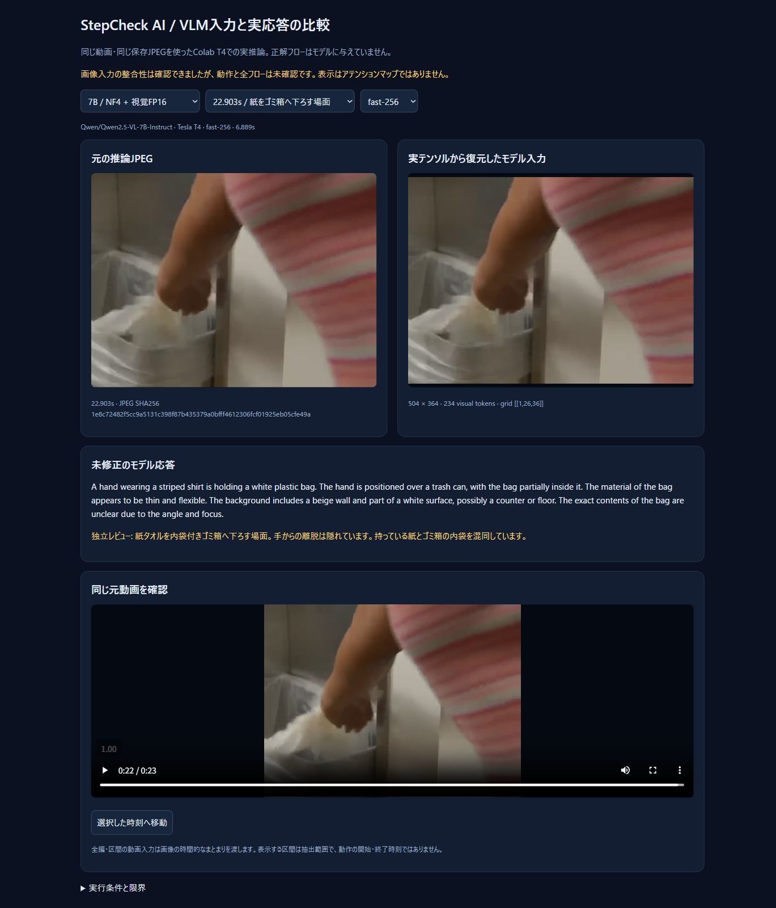

# 同じ動画でVLMの入力と誤認を確認

2026-10-08、Colab T4で実推論しました。対象は同梱のCDC動画1本です。
**入力画像の整合性は確認できましたが、フロー全体と順序は未確認です。**
正解の7動作や期待手順はモデルに与えていません。

## 比較した条件

以前の24フレーム実行から、13.940957、17.924087、21.907217、22.903秒の
保存JPEGをそのまま使いました。WindowsとColabで再抽出するとJPEGの符号化が異なるため、
比較では保存済みの同一バイト列を固定しています。

| 実験 | 条件 | 実推論回数 |
| --- | --- | --- |
| 3B / FP16 | fast・slow画像処理 × 最大256・1024パッチ × 4画像 | 16 |
| 7B / NF4 | 視覚も4bit、fast × 最大256・1024パッチ × 4画像 | 8 |
| 7B / NF4 + 視覚FP16 | fast × 最大256・1024パッチ × 4画像 | 8 |
| 7B / 動画入力 + 視覚FP16 | 同じ24枚の全編と、順番を維持した6枚ずつの4区間 | 5 |
| Qwen3-VL-4B / FP16 | fast × 同じ最大画素数2条件 × 同じ4画像 | 8 |

静止画実験では共通の短い観測プロンプトを使いました。
以前のフロー抽出とはプロンプトも異なるため、以前との変化を量子化だけの効果とは扱いません。
動画実験は別の共通プロンプトで、動作を時系列のリストにするよう依頼しました。

## 実際のモデル入力を確認

モデルに渡す直前の `pixel_values` と視覚グリッドから、パッチ配置と正規化を逆変換しました。
復元画像は実テンソルに対応する画像で、アテンションやモデル内部の特徴マップではありません。
画像・動画のプレースホルダ数が視覚グリッドから計算した数と一致することも検査しています。
色、位置、時間順を確認する非対称RGB画像のテストも用意しました。

この4場面では画像の取り違えや大きな色・位置の崩れは見つかりませんでした。
Qwen2.5-VLでは最大256パッチ相当の画素数上限で504 × 364画素・234視覚トークン、1024では644 × 476画素・391トークンでした。
1024は上限で、元画像に存在しない細部が増えるわけではありません。
Qwen3-VLはパッチサイズが異なり、同じ200,704 / 802,816画素の上限では
512 × 384画素・192トークン / 640 × 480画素・300トークンになりました。
同じJPEG・プロンプト・画素数上限ですが、実際の視覚トークン数は同一ではありません。

7Bの実ロード状態も記録しました。通常のNF4では視覚の線形層が `Linear4bit / uint8`、
視覚を保持した条件では `Linear / float16` であることを確認しています。
GPUセッションを再起動し、モデル切り替え前のGPU割り当ても記録して比較しました。

## 元動画との照合

次の観測は推論後の独立したレビューです。モデルへの入力には含めていません。

| 元動画の場面 | 静止画VLMの結果 |
| --- | --- |
| 紙タオルの取得 | 装置や紙を認識する応答は出るが、高解像度条件でも動作の誤認がある |
| 紙で手を拭く | 装置から紙を取る動作と混同した |
| 紙越しにドアの取っ手を保持 | 袋・電子機器などと誤認。開扉は元動画でも断定できない |
| 紙を内袋付きゴミ箱へ下ろす | 持っている紙とゴミ箱の内袋を混同。手から離す瞬間は隠れる |

fastからslowへの変更、画像上限の引き上げ、モデルの3Bから7Bへの変更、視覚部分のFP16保持では、
4場面すべてを正しく説明する条件は得られませんでした。
これはこの動画・条件での結果で、モデル全般の精度や誤認原因を確定するものではありません。

動画入力の全編応答には「紙を取って手を拭く」が入りましたが、冒頭に見えていない蛇口操作を追加し、
取っ手・ゴミ箱の場面を落としました。第4区間にはゴミ箱への動作が入りましたが、
紙の取得と廃棄を何度も繰り返す、元動画にない動作も生成しました。
区間を分けても、フローの完全一致や順序の確認には使えませんでした。
動画入力の自然文から、根拠フレームIDや正確な動作境界を推測してフローレポートに変換していません。

## Qwen3-VL-4Bで追加比較

同じColab T4・Transformers 4.57.1で、量子化せずFP16の4Bモデルを実行しました。
モデルクラスは `Qwen3VLForConditionalGeneration`、リビジョンは
`ebb281ec70b05090aa6165b016eac8ec08e71b17` です。
4場面を2条件で認識した実応答は各4.980〜5.965秒で、重みの取得とモデル読み込みは含みません。

紙の取得と、ドアの取っ手・ゴミ箱という対象物の説明は改善しました。
一方、手拭きは低解像度でディスペンサーへの接触、高解像度で石けんで手を擦る動作と誤認しました。
最後の場面は、持っている紙をゴミ箱の内袋と混同し、袋を掴む・調整する動作と説明しました。
取っ手は低解像度で布越しの接触、高解像度で拭く動作と説明し、保持から拭きへの過剰な解釈もあります。
**Qwen3でも4場面すべての動作が正しい条件は得られていません。**
画像の解像度を上げれば必ず改善する、という結果でもありません。
これは推論後の独立レビューで、これらの動作をモデルに教えていません。



全編24枚の個別認識も実行しました。最初の整理は同じ動作を繰り返してJSONが途切れたため失敗しました。
説明を短くして同じ根拠の重複を避ける指示を加えた再試行は、172.292秒で3動作の有効なJSONを返しました。
両試行の24観測文は同一でした。対象物の認識改善が、完全なフローの抽出にそのままつながったわけではありません。
手拭きを紙の取得にまとめ、取っ手の時刻をゴミ箱投入に使う誤りが残っています。
[全編の生出力・初回失敗・7動作との照合・GIF](colab-local-vlm.md#colabで実行して確認したこと)を保存しています。

## 保存された結果と確認画面

[比較画面のHTML](assets/vlm-input-diagnostics/viewer.html)では、モデル・場面・入力条件を切り替え、
元の推論JPEG、実テンソルからの復元画像、未修正の応答を見比べられます。
GitHubではHTMLがソース表示になります。リポジトリを取得してHTMLを開くか、ローカルHTTPサーバーで表示してください。



- [3Bの16応答・実入力](assets/vlm-input-diagnostics/stepcheck-input-diagnostics-3b/diagnostics.json)
- [7B / 視覚4bitの8応答・実入力](assets/vlm-input-diagnostics/stepcheck-input-diagnostics-7b-all4bit/diagnostics.json)
- [7B / 視覚FP16の8応答・実入力](assets/vlm-input-diagnostics/stepcheck-input-diagnostics-7b-vision-fp16/diagnostics.json)
- [動画入力の全編・4区間の生応答](assets/vlm-input-diagnostics/stepcheck-native-video-7b/diagnostics.json)
- [Qwen3-VL-4Bの8応答・実入力](assets/vlm-input-diagnostics/stepcheck-input-diagnostics-qwen3-4b/diagnostics.json)

画面の再生成は保存結果の表示で、推論ではありません。

```bash
python scripts/render_vlm_diagnostics.py docs/assets/vlm-input-diagnostics docs/assets/video-demo/source.webm docs/assets/vlm-input-diagnostics/viewer.html
python -m http.server 8005 --directory docs/assets
# http://localhost:8005/vlm-input-diagnostics/viewer.html
```

Colabで同じ静止画比較を再実行する場合、セットアップ後に:

今回の7B比較はStepCheck用GPUセッションを再起動してから実行しました。
別のモデルを保持したまま読み込んだ試行ではメモリー不足になったため、比較前に既存モデルを解放してください。

```python
from diagnose_local_vlm import run_diagnostics
from stepcheck_providers import create_provider
provider = create_provider("qwen-local", model="Qwen/Qwen2.5-VL-7B-Instruct",
    load_in_4bit=True, keep_vision_fp16=True)
await run_diagnostics(provider, VIDEO_PATH, Path("/content/input-diagnostics"),
    variants=[(True,256),(True,1024)],
    frames_report=REPO/"docs/assets/video-demo/qwen-3b-framewise-flow.json")
```

同じプロバイダーで動画入力を比較する場合:

```python
from diagnose_native_video import run_native_diagnostics
await run_native_diagnostics(provider, VIDEO_PATH,
    REPO/"docs/assets/video-demo/qwen-3b-framewise-flow.json",
    Path("/content/native-video-diagnostics"))
```

公開するREADME GIFには引き続き未修正のフロー出力と独立レビューを表示しています。
今回の実験で確認できなかった動作を、成功済みの表示へ置き換えていません。

その後の[Qwen3の動画入力実験](qwen3-native-video.md)では、重なる3区間と
2fpsの全体入力をローカル6GB GPUで実行しました。READMEの最新GIFはこちらの実回答です。
これらは上記の45条件の比較ビューアーとは別に保存しています。
全体の3工程は手拭き・取っ手・ゴミ箱の根拠に誤りがあり、7工程の順序は未確認です。

実装の参照先: Transformers 4.57.1の
[画像処理](https://github.com/huggingface/transformers/blob/v4.57.1/src/transformers/models/qwen2_vl/image_processing_qwen2_vl_fast.py)、
[動画処理](https://github.com/huggingface/transformers/blob/v4.57.1/src/transformers/models/qwen2_vl/video_processing_qwen2_vl.py)、
[Qwen2.5-VLプロセッサー](https://github.com/huggingface/transformers/blob/v4.57.1/src/transformers/models/qwen2_5_vl/processing_qwen2_5_vl.py)、
[4bit量子化](https://huggingface.co/docs/transformers/v4.57.1/en/quantization/bitsandbytes)。
